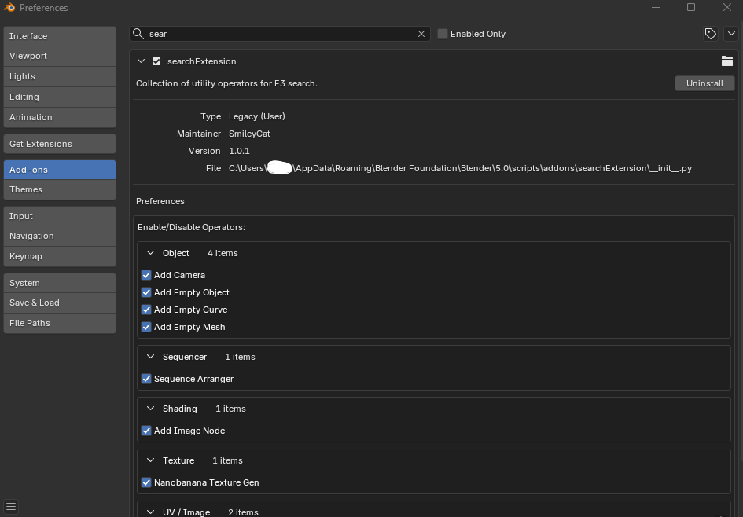

# Search Extension

English:
**Search Extension** is a collection of utility operators for Blender, designed to enhance your workflow. It includes various tools accessible via the F3 search menu, ranging from simple helpers to advanced AI-powered texture generation.

日本語:
**Search Extension** は、ワークフローを効率化するために設計されたBlender用ユーティリティオペレーター集です。F3検索メニューからアクセスできる様々なツールを含み、シンプルな補助機能から高度なAIテクスチャ生成まで幅広く対応しています。

## Vision / ビジョン

English:
We envision a future where this project contains **hundreds or even thousands of features**. To keep Blender's UI clean and uncluttered as the feature count grows, all tools are accessible **only through the F3 search menu**—no additional panels or sidebars.

日本語:
このプロジェクトには、将来的に**数百、あるいは数千もの機能**が追加されることを想定しています。機能が増えてもBlenderのUIを煩雑にしないよう、すべてのツールは**F3検索メニューからのみ**アクセスできる設計にしています。追加のパネルやサイドバーは使用しません。

## Features / 機能一覧

| Feature / 機能名 | Description (English) | Description (Japanese) | Documentation |
| :--- | :--- | :--- | :--- |
| **NanoBanana Texture Gen** | AI-powered texture generation tool using Google Gemini API. Supports UV, Camera, and Atlas generation modes. | Google Gemini APIを使用したAIテクスチャ生成ツール。UV、カメラ、アトラス生成モードをサポート。 | [READ MORE](src/nanobanana_texture_gen/README.md) |
| **Add Camera** | Utilities for adding and managing cameras. | カメラの追加と管理を行うユーティリティ。 | [READ MORE](src/add_camera/README.md) |
| **Add Empty Curve** | Add empty curve objects quickly. | 空のカーブオブジェクトを素早く追加します。 | [READ MORE](src/add_empty_curve/README.md) |
| **Add Empty Mesh** | Add empty mesh objects quickly. | 空のメッシュオブジェクトを素早く追加します。 | [READ MORE](src/add_empty_mesh/README.md) |
| **Add Empty Object** | Add empty objects quickly. | 空のオブジェクトを素早く追加します。 | [READ MORE](src/add_empty_object/README.md) |
| **Add Image Node** | Helper to add image nodes in the Shader Editor. | シェーダーエディタで画像ノードを追加するヘルパー。 | [READ MORE](src/add_image_node/README.md) |
| **Input Console** | Run python scripts in Blender console. | BlenderのコンソールでPythonスクリプトを実行します。 | [READ MORE](src/input_console/README.md) |
| **Move to Center** | Move the selected object to the center of the viewport. | 選択したオブジェクトをビューポートの中心に移動します。 | [READ MORE](src/move_object_to_center_of_view/README.md) |
| **Render Save Image** | Render and save images directly. | 画像をレンダリングして直接保存します。 | [READ MORE](src/render_save_image/README.md) |
| **Save UV Layout** | Export the UV layout of the selected object. | 選択したオブジェクトのUVレイアウトをエクスポートします。 | [READ MORE](src/save_uv_layout/README.md) |
| **Sequence Arranger** | Tools for arranging strips in the Video Sequencer. | ビデオシーケンサー内のストリップを配置・整理するツール。 | [READ MORE](src/sequence_arranger/README.md) |

## Download / ダウンロード

English:
This is a volunteer project. I would be happy if you purchased something from my Booth shop to support development: https://arthur484.booth.pm/

1. Download the latest release from the [Releases Page](https://github.com/arthur-vr/SearchExtension/releases).
2. Open Blender and go to **Edit > Preferences > Add-ons**.
3. Click **Install...** and select the downloaded zip file.
4. Enable the addon **Search Extension**.

日本語:
ボランティアでの開発です。もしよろしければ、Boothで何か購入していただけると嬉しいです： https://arthur484.booth.pm/

1. [リリースページ](https://github.com/arthur-vr/SearchExtension/releases) から最新のリリースをダウンロードします。
2. Blenderを開き、**編集 > プリファレンス > アドオン** に移動します。
3. **インストール...** をクリックし、ダウンロードしたzipファイルを選択します。
4. アドオン **Search Extension** を有効にします。

## Usage / 使い方

English:
Most features can be accessed by pressing **F3** and searching for the command name (e.g., "NanoBanana", "Save UV", etc.).

You can customize which features appear in the search results by enabling or disabling them in **Preferences > Add-ons > Search Extension**. Features that are disabled will not appear when using F3 search.

日本語:
ほとんどの機能は **F3** を押してコマンド名（"NanoBanana"、"Save UV"など）を検索することでアクセスできます。

**プリファレンス > アドオン > Search Extension** から各機能の有効/無効を切り替えることで、検索結果に表示される機能を柔軟にカスタマイズできます。無効化した機能はF3検索に表示されなくなります。

## AI Development Workflow / AIを使った開発の方法

English:
We recommend using GitHub **WorkTree** for development.

The rule files included in this project are compatible with most AI agents, so you can use them with your preferred agent without issues.
The root rule file describes how to add new rules. You can simply ask the agent "I want to add a rule like this," and it can be added.

When sending a **Pull Request**, we would greatly appreciate it if you could include a **video** showing usage, in addition to the description of the changes.

日本語:
GitHubの **WorkTree** 機能を使用した開発を推奨しています。

このプロジェクトのルールファイルは、多くのAIエージェントと互換性があるため、お使いのエージェントでも問題なく利用できます。
ルートのルールファイルにはルールの追加方法が記述されています。エージェントに「こういうルールを追加したい」と指示すれば、適切に追加することができます。

**Pull Request** を送る際は、変更内容の説明に加えて、機能が動作している様子の **動画** を添付していただけると大変嬉しいです。

## Contributing / 貢献について

English:
This project is **fully AI-driven**. We welcome contributions from AI agents and developers using AI assistants!

📖 **[Read the Contributing Guide](docs/contributing/README.md)**

| Document | Description |
|:---------|:------------|
| [Branch Strategy](docs/contributing/BRANCH_STRATEGY.md) | Branch naming rules and workflow |
| [Commit Convention](docs/contributing/COMMIT_CONVENTION.md) | Commit message guidelines |
| [Pull Request Guide](docs/contributing/PULL_REQUEST.md) | How to submit a PR |
| [AI Development Guide](docs/contributing/AI_DEVELOPMENT.md) | AI agent-specific guidelines |

**Quick Start:**
1. Fork the repository
2. Create a feature branch from `dev`: `feature/your-feature-name`
3. Make changes and build: `cd bin && pnpm build`
4. Submit PR to `dev` branch (include video if possible!)

日本語:
このプロジェクトは**完全にAI駆動開発**です。AIエージェントやAIアシスタントを使用する開発者からの貢献を歓迎します！

📖 **[コントリビューションガイドを読む](docs/contributing/README.md)**

| ドキュメント | 説明 |
|:------------|:-----|
| [ブランチ戦略](docs/contributing/BRANCH_STRATEGY.md) | ブランチ命名規則とワークフロー |
| [コミット規約](docs/contributing/COMMIT_CONVENTION.md) | コミットメッセージのガイドライン |
| [プルリクエストガイド](docs/contributing/PULL_REQUEST.md) | PRの提出方法 |
| [AI開発ガイド](docs/contributing/AI_DEVELOPMENT.md) | AIエージェント向けガイドライン |

**クイックスタート：**
1. リポジトリをフォーク
2. `dev`からフィーチャーブランチを作成: `feature/your-feature-name`
3. 変更してビルド: `cd bin && pnpm build`
4. `dev`ブランチへPRを提出（可能なら動画も！）

## License / ライセンス

[Dual License](LICENSE.md)

### Non-Commercial Use / 非商用利用
CC BY-NC-SA 4.0

### Commercial Use / 商用利用
All commercial rights reserved. You can use this addon for commercial projects, but you cannot resell the addon itself.
商用利用の権利は留保されていますが、このアドオンを使用して作成した作品の販売や商用プロジェクトでの利用は許可されています。アドオン自体の再販は禁止です。
