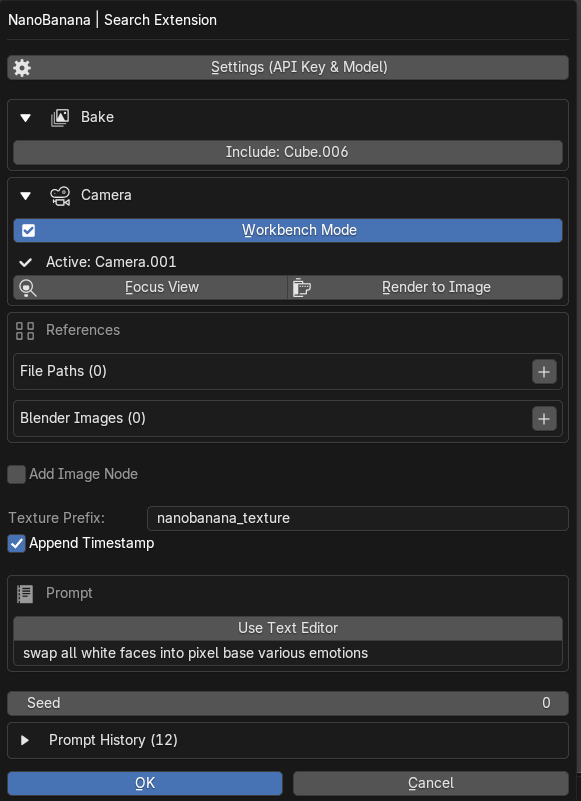

# NanoBanana (Texture Generation)

## Demo Link (x.com)

## Description
English:
NanoBanana is an AI-powered texture generation tool integrated directly into Blender. Using Google's Gemini API, it generates textures based on reference images and text prompts.

日本語:
NanoBananaは、Blenderに直接統合されたAI駆動のテクスチャ生成ツールです。GoogleのGemini APIを使用して、参照画像とテキストプロンプトに基づいてテクスチャを生成します。

## Download
English:
This is part of the Search Extension addon.
[Download](https://github.com/arthur-vr/SearchExtension/releases)

## How to use

English:
- Search for `NanoBanana` in the F3 search menu.

日本語:
- F3検索メニューで `NanoBanana` を検索します。

## Panel Description

### Settings (API Key & Model)
English:
- Opens the settings dialog to configure **API Key** and **Model**.
- Get your API key from [Google AI Studio](https://aistudio.google.com/app/apikey).
- Available models: NanoBanana 3 Pro Image, NanoBanana 2.5 Flash Image, Gemini 2.0 Flash Experimental, or Custom Model.

日本語:
- **APIキー**と**モデル**を設定するダイアログを開きます。
- APIキーは [Google AI Studio](https://aistudio.google.com/app/apikey) から取得できます。
- 利用可能なモデル: NanoBanana 3 Pro Image、NanoBanana 2.5 Flash Image、Gemini 2.0 Flash Experimental、またはカスタムモデル。

### Bake Section (Collapsible)
English:
- **Include: [Object Name]**: When enabled, uses the active mesh object's texture as a reference image for generation.
- **Bake Mode**: Select bake type (Vertex Color, Combined, Diffuse, Normal).
- **Preview**: Bakes the texture and applies it to the object's material for visual inspection.

日本語:
- **Include: [オブジェクト名]**: 有効にすると、アクティブなメッシュオブジェクトのテクスチャを生成の参照画像として使用します。
- **Bake Mode**: ベイクタイプを選択（Vertex Color、Combined、Diffuse、Normal）。
- **Preview**: テクスチャをベイクし、オブジェクトのマテリアルに適用してプレビュー表示します。

### Camera Section (Collapsible)
English:
- **Workbench Mode**: Toggles Workbench rendering mode for camera renders (useful for clean reference captures).
- **Focus View**: Moves the 3D viewport to match the active camera's view.
- **Render to Image**: Renders the current camera view as a reference image.
- **Add Camera**: Adds a new camera to the scene (shown when no active camera exists).

日本語:
- **Workbench Mode**: カメラレンダリング用のWorkbenchモードを切り替えます（クリーンな参照キャプチャに便利）。
- **Focus View**: 3Dビューポートをアクティブカメラのビューに移動します。
- **Render to Image**: 現在のカメラビューを参照画像としてレンダリングします。
- **Add Camera**: シーンに新しいカメラを追加します（アクティブカメラがない場合に表示）。

### References Section
English:
- **File Paths**: Add external image files as references. Click `+` to add, `X` to remove.
- **Blender Images**: Add images from Blender's internal image data. **This is powerful - you can use any image loaded or created within Blender as a reference.** Click `+` to add, then select an image from the dropdown.

日本語:
- **File Paths**: 外部画像ファイルを参照として追加します。`+`で追加、`X`で削除。
- **Blender Images**: Blenderの画像データから参照を追加します。**これは強力な機能で、Blender内で読み込んだり作成したりした任意の画像を参照として使用できます。** `+`で追加後、ドロップダウンから画像を選択します。

### Add Image Node
English:
- **Add Image Node**: When enabled, automatically adds an Image Texture node to the active object's material after generation. **Even if the object has no Image Texture node, one will be created automatically.**

日本語:
- **Add Image Node**: 有効にすると、生成後にアクティブオブジェクトのマテリアルにImage Textureノードを自動追加します。**オブジェクトにImage Textureノードがなくても、自動的に作成されます。**

### Output Config
English:
- **Texture Prefix**: Base name for generated texture files.
- **Append Timestamp**: Adds timestamp to the generated texture name to avoid overwriting.

日本語:
- **Texture Prefix**: 生成されるテクスチャファイルの基本名。
- **Append Timestamp**: 上書きを避けるために生成されたテクスチャ名にタイムスタンプを追加します。

### Prompt Section
English:
- **Use Text Editor**: Toggle to use a Blender Text datablock for longer prompts. When enabled, you can select or create a text block and open it in Blender's Text Editor.
- **Prompt field**: Enter your generation prompt directly (when Text Editor is disabled).
- **Seed**: Random seed for generation (0 = random).

日本語:
- **Use Text Editor**: より長いプロンプト用にBlenderのテキストデータブロックを使用するトグル。有効時は、テキストブロックを選択または作成し、BlenderのText Editorで開けます。
- **Prompt field**: 生成プロンプトを直接入力します（Text Editor無効時）。
- **Seed**: 生成のランダムシード（0 = ランダム）。

### Prompt History (Collapsible)
English:
- Shows previous generation prompts and settings.
- **Load**: Restores a previous prompt to the current input.
- **Copy**: Copies the prompt to clipboard.
- **Delete (X)**: Removes the history entry.

日本語:
- 過去の生成プロンプトと設定を表示します。
- **Load**: 過去のプロンプトを現在の入力に復元します。
- **Copy**: プロンプトをクリップボードにコピーします。
- **Delete (X)**: 履歴エントリを削除します。

## Differences from other tools
English:
- **Direct AI Integration**: Uses `Google Gemini API` to generate textures directly within Blender.
- **Integrated Workflow**: Seamlessly bake, generate, and apply textures without external software.
- **Multiple Reference Support**: Combine baked textures, external files, and Blender internal images as references.

日本語:
- **AI直接統合**: `Google Gemini API` を使用してBlender内で直接テクスチャを生成します。
- **統合ワークフロー**: 外部ソフトを使わずに、ベイク、生成、適用をシームレスに行えます。
- **複数参照サポート**: ベイクしたテクスチャ、外部ファイル、Blender内部画像を参照として組み合わせられます。

## Q&A
### English:
#### Image generation takes time
##### Since it communicates with the Gemini API for generation, it relies on internet speed and API response times.

#### Quality of generated textures
##### It depends on the selected AI model and the input prompts/references. Try refining your prompts or using different reference images.

#### API Key not working
##### Make sure you have enabled the Gemini API in your Google Cloud project and the key has appropriate permissions.

### 日本語:
#### 画像生成に時間がかかる
##### 生成のためにGemini APIと通信しているため、インターネット速度やAPIの応答時間に依存します。

#### 生成されたテクスチャの画質について
##### 選択したAIモデルや入力プロンプト、参照画像に依存します。プロンプトを調整するか、異なる参照画像を試してみてください。

#### APIキーが機能しない
##### Google CloudプロジェクトでGemini APIが有効になっていること、およびキーに適切な権限があることを確認してください。
